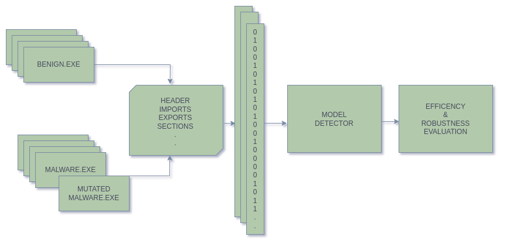

# DetEXE

[](http://www.python.org/download/)

A tool to build and analyze static malware detectors, based on machine learning.

<p align="center" >

</p>


DetEXE allows the selection of different features to train malware detectors through the LightGBM framework.
The project is developed in a way that users can contribute by adding new features and combining them.
It also offers the the options to compare the created models and evaluate the detectors' robustness by perturbing malware files.


## Installation

To install the latest version:
```
$ pip install detexe
```

## Setup
1. Set up DetEXE environment variable.
```
$ export DETEXE_ROOT=$PWD
```

2. Create a project layout containing the needed directories to store the data of the project.
```
$ detexe setup
```

3. Add executable samples to the benign and malware directories. You can obtain them from different sources.
SOREL, ViruSshare... (As you are working with malware samples, please, take the safety measures).
4. Configure the features_selection.txt file with the features you wish to extract from the files.
5. In case you would like to select the feature OpCodeVectors, you will need to use previously the following command,
to create the W2V model.
```
$ detexe opcodesw2v
```
## How to use
### CLI

1. Train your model.
```
$ detexe train --model="foo"
```

2. Execute adversarial attacks on your trained model.

    It is possible to select one specific attack, or all ddiferent attacks with one command:
```
$ detexe attack padding --model="foo" --malware="/malware/path.exe"
```

```
$ detexe attack all --model="foo" --malware="/malware/path.exe"
```

3. Compare the trained models.
```
$ detexe compare 
```
4. Search for optimal parameters to obtain better result in training. This parameteres will be saved in the model directory.
```
$ detexe tune --model="foo"
```
4. Scan a PE file with a trained model.
```
$ detexe scan --model="foo" --exe="/malware/path.exe"
```
### Python
1. Import functions and classes.
```
import os
from detexe import configure_layout, train_opcode_vectors, Detector, Attacker, compare
```
2. Setup project directories.
```
os.environ["DETEXE_ROOT"] = os.path.dirname(os.path.abspath(__file__))
configure_layout()
```
3. Configure the features_selection.txt file with the features you wish to extract from the files.
4. In case you would like to select the feature OpCodeVectors, you will need to train previously the W2V model.
```   
train_opcode_vectors()
```
5. Instanciate a detector object
```
detector = Detector(model="model_foo", config_features="/path/to/features_selection.txt")
```
6. With the instance of detector you will be able to train, tune and scan.
```
detector.train()  # Train the model
detector.tune()  # Tune the hyperparameters
detector.scan("/path/to/exe")  # Scan a file 
```

7. The efficiency of the created models can be compared, and visualized in a created graph.
```
compare("model_comparation.png")
```

8. Evaluate the robustness of a certain model.
```
attacker = Attacker(model="model_foo")
attacker.malware("/path/to/malware.exe")  # Choose the malware to ve modified for attacking the model.
attacker.all_attacks() # Choose one specific attack or all.
```
## Add your own features
1. Add new feature class in separated file under ./detexe/ped/features/your_feature.
2. Update ./features_selection.txt file.

## Built With
* [LIEF](https://github.com/lief-project/LIEF) - A cross-platform library which can parse, modify and abstract ELF, PE and MachO formats.
* [EMBER](https://github.com/elastic/ember) - Elastic Malware Benchmark for Empowering Researchers.
* [SecML Malware](https://github.com/pralab/secml_malware) -  Python library for creating adversarial attacks against Windows Malware detectors. 
